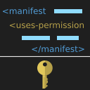

<p align="center">
  
</p>

<br/>
<h1 align="center">Android permissions helper</h1>
<br/>

<p align="center">A VS Code extension that simplifies the process of adding android permissions to AndroidManifest.xml file</p>

<hr />


## Build

You must have `nodejs`, `npm` and `git` installed on your os

1- Clone the repo

``` 
git clone https://github.com/XxA7med66xX/android-permissions-helper.git && cd android-permissions-helper
```

2- Install dependencies

```
npm install 
```

3- Build

```
npm run build
```

The output will be a file with .vsix extension located in repo directory.

## Installation

1- In vscode open extensions section or press Ctrl+Shift+X.

2- Click on the three dots in the top right corner of the Extensions view and select "Install from VSIX".

3- In the file explorer window, navigate to the location of the VSIX file you obtained and select it.

## Icon Credits
The key icon in the extension icon was sourced from the [SVG repo](https://www.svgrepo.com/svg/484416/key) website.
